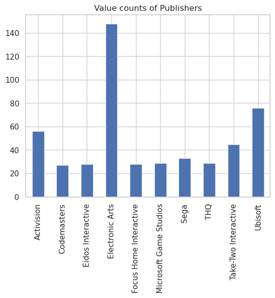

### png into a markdown file
To save a png, if export does not work, copy it to clipboard and use
save-png alias in the terminal which is short for 
xclip -selection clipboard -t image/png -o >
follow it with the filepath.  

  
  
  
  

